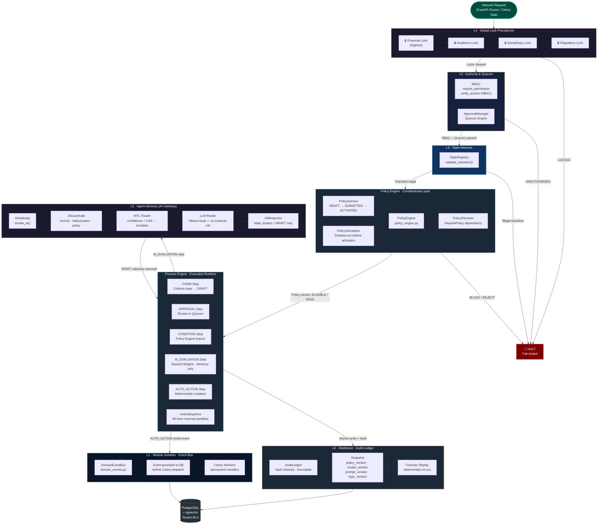

# ALIS — Core Kernel Architecture

> `server/core/` · `server/process_engine/` — *Governed Autonomy Kernel*

## Kernel Component Map

| Layer | File | Role |
|---|---|---|
| **L1 — Event Bus** | `core/domain_events.py` | Durable cross-module messaging; events persisted before Celery dispatch |
| **L2 — AI Gateway** | `core/ai_gateway.py` | PII masking, guardrails, HITL routing, DRAFT-only output contract |
| **L3 — State Machine** | `core/state_registry.py` | Enforces legal transition paths for every domain entity |
| **L4 — Global Locks** | `core/locks.py` | Financial → Academic → Disciplinary → Regulatory precedence |
| **L5 — Authority** | `core/rbac.py` + `core/approvals.py` | RBAC `@require_permission` + `ApprovalManager` quorum |
| **L6 — Audit Ledger** | `core/audit.py` | Immutable hash-chain; snapshots `policy_version`, `model_version` |
| **Policy Engine** | `core/policy_engine.py` | Rules-as-data (`asteval`); verdicts: ELIGIBLE / PASS / BLOCK / REJECT |
| **Process Engine** | `process_engine/` | Stateful multi-step workflow runtime (FORM, APPROVAL, AI, AUTO_ACTION) |
| **Undo Sequence** | `core/undo_sequence.py` | 90-hour formal reversal — workflow, not DB rollback |
